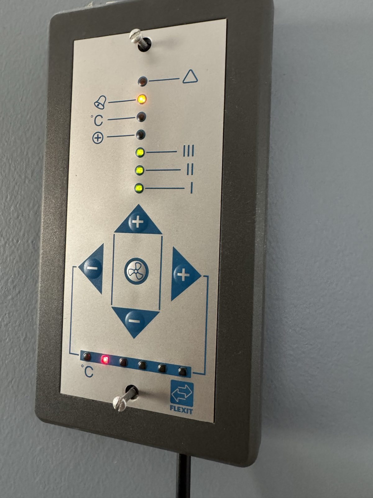
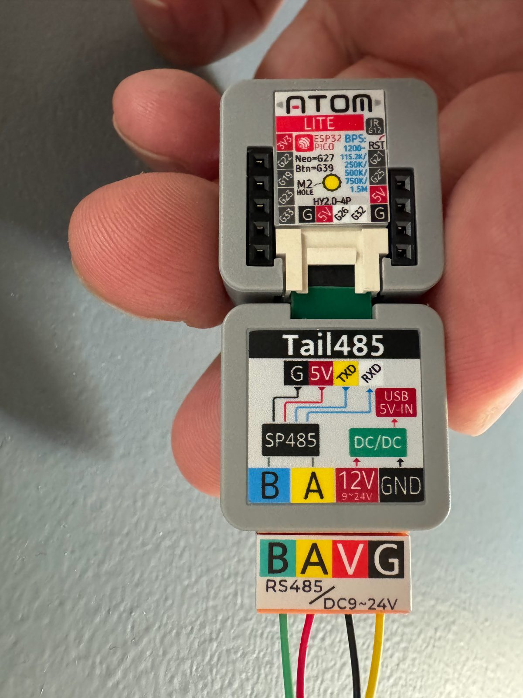
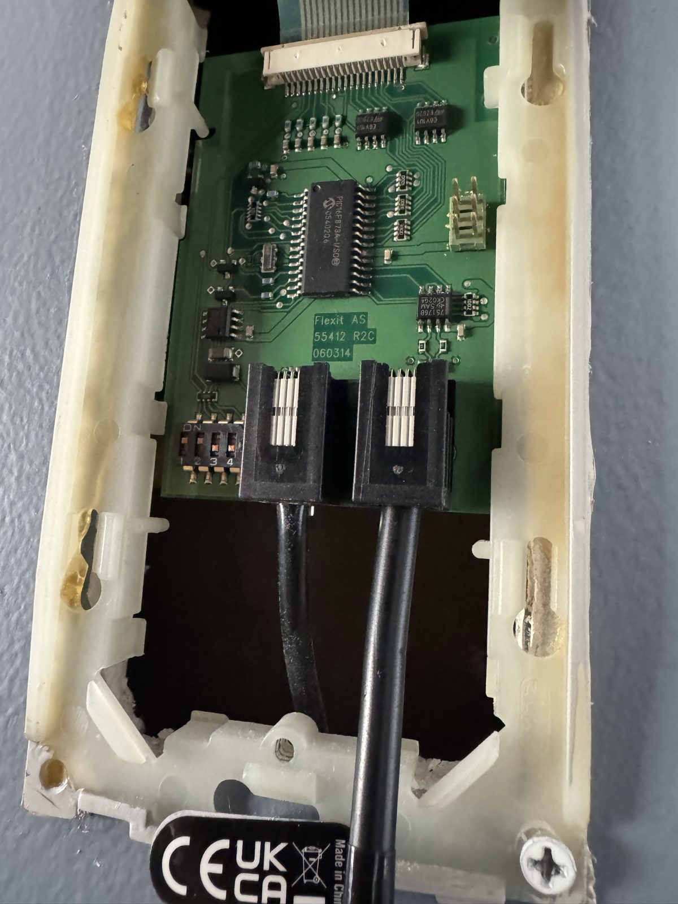

# Flexit SL4R (CS50/CI50) — ESPHome integration over RS485

Two-way integration of a Flexit SL4 R air handling unit (CS50 main board, CI50
control panel) into Home Assistant, over the unit's own RS485 bus and without
Flexit's CI66 Modbus adapter.

Hardware: an M5Stack **ATOM Lite** (ESP32) plus an **ATOM Tail485**
(TTL↔RS485, SKU T002), wired in parallel with the CI50 in the **spare 4P4C
socket** on the back of the control panel, and powered from the bus's own 12 V
(measured 11.8 V). No need to open the air handling unit.

The protocol is documented in **[`PROTOCOL.md`](PROTOCOL.md)**.

### Official documentation

Flexit's own material for this unit. All three are worth having open when
reading `PROTOCOL.md`; the CS 50/CS 500 manual in particular names the
parameters this integration reads off the bus.

- [SL4 R product page](https://www.flexit.no/produkter/base/26380/ventilasjonsaggregat-sl4-r/)
  ([documentation tab](https://www.flexit.no/produkter/base/26380/ventilasjonsaggregat-sl4-r/?focus-on=documentation))
- [CS 50 / CS 500 control automation](https://www.flexit.no/globalassets/catalog/documents/man_94269n_3749.pdf) — 94269N-02, the controller's parameter and terminal reference
- [CI 50 control panel](https://www.flexit.no/globalassets/catalog/documents/man_110191n_3748.pdf) — 110191N-07, the panel this integration impersonates
- [Operating instructions, S3 R / SL4 R / S4 R / S7 R](https://www.flexit.no/globalassets/catalog/documents/fdv_94273n_3270.pdf) — 94273N-07, the unit itself

The manuals are in Norwegian and are copyrighted, so they are linked at source
rather than copied into this repository.

## Status

**Two-way control works against a real installation.**

- **Reading:** supply air temperature, fan level (running and return), fan duty
  in percent for both fans, heat exchanger setpoint, heat demand, boost state,
  **filter alarm**, the **afterheater setting**, and from the parameter registers
  the **filter timer** — hours since the filter was last reset — together with
  the filter interval. Plus diagnostic entities for fields not yet decoded, so Home
  Assistant's recorder builds history to correlate against.
- **Writing:** fan level, setpoint, boost, cancel boost, afterheater on/off and
  filter reset — all verified against the CS50's own broadcast values, not just
  against our own UI state.
- **A `climate` entity** gathers setpoint, fan mode, boost preset and
  HEAT/FAN_ONLY (afterheater) into one thermostat model.
- **Operational diagnostics:** an `enumerated` binary sensor shows whether the
  CS50 is still polling us. If it goes off, writing fails *silently* and the
  unit must be power-cycled — you should alert on this.

## How it works

The bus is **polled**. The master sends a 5-byte poll to one node at a time and
only the addressed node may answer:

```
POLL  (master):  C3 <node> 00 <ck1> <ck2>
REPLY (node):    <TYPE> <node> <LEN> <data...> <ck1> <ck2>
```

At startup the CS50 probes nodes 2, 3 and 5 five times each. A node that does
not answer is dropped for the rest of the run. We therefore answer on **node
5**, which is free on a single-panel installation, and are then polled
continuously, including across our own restarts. No second physical panel is
needed — that was measured, not assumed.

Getting there took a while, because the obvious model treats poll and reply as
one frame with an 8-byte header. That model reads fine and fails completely for
writing. [`PROTOCOL.md`](PROTOCOL.md) has the full specification;
[`research/protocol-notes.md`](research/protocol-notes.md) has the
chronological derivation including the dead ends, in Norwegian.

## Entities

Names below are from [`example.yaml`](example.yaml). Every entity is optional —
take what you need, name it what you like.

**Control**

| Entity | Type | Notes |
|---|---|---|
| Fan level | `select` | 1–3. Setting a level cancels an active boost |
| Heat exchanger setpoint | `number` | 15–25 °C |
| Boost | `switch` | "Max fan", 30 minutes. **We time it ourselves** — see below. Off sends the panel's own cancel command |
| Afterheater | `switch` | Writes the flag directly — unlike the panel gesture, it cannot trigger a filter reset |
| Reset filter timer | `button` | Runs the manual's full procedure automatically |
| Ventilation | `climate` | All of the above in one thermostat model |

The climate entity uses Home Assistant's **standard** fan modes — `low`,
`medium`, `high` — so the frontend renders them in each user's own language
("Lav/Middels/Høy" in Norwegian). A custom string would be shown verbatim to
everyone, in whatever language it was written in. They map to Flexit's own
descriptions in the CI 50 manual: `low` = level 1, reduced ventilation for an
empty home; `medium` = level 2, the everyday setting; `high` = level 3,
increased ventilation for wet rooms. Note that `high` is a permanent setting
and not the same as BOOST, which is timed and backs out by itself. The `select`
entity keeps 1/2/3, because that is what the panel's three LEDs show — and
digits need no translation.

**Measurement**

- Supply air temperature
- Heat demand (0–100, drives the rotor)
- Fan duty, supply and extract (%)
- Fan level, running and return
- Setpoint, read back from the bus
- Spare sensor inputs — these hide themselves when nothing is connected
- Filter hours and filter interval
- **Filter age** and **filter change due in**, in days
- Fan duty configured per level

The last pair are template sensors in the configuration rather than component
code, because only one of them is exact. *Filter age* is the filter timer in
days and nothing more. *Filter change due in* has to convert an interval given
in **months** into the timer's **hours**, and the conversion the CS 50 uses has
not been measured — 730 h per month is assumed, which is within about three
days of a 30-day month over a six-month interval. Good enough to plan around,
not exact enough to argue with the unit: the filter alarm remains the authority.
Keeping the arithmetic in YAML means you can see the assumption and change it
without rebuilding firmware.

**State and alarm**

- Filter alarm
- **Unknown alarm**
- Boost active
- **Heat recovery running** — the rotor is actually turning, not merely that
  demand exists
- **Bypass (assumed)**

"Unknown alarm" is any bit in the alarm field other than the filter bit. We do
not know which bit is the rotor alarm and which is the overheat thermostat, but
this entity catches them the day they fire, with the raw frame in the anomaly
log.

"Bypass (assumed)" is an open guess and the name says so: the bit has never
been observed set on our rotary unit. If it ever changes, it is logged as an
anomaly with the full frame. It may not be bypass at all — see
[`PROTOCOL.md` §5.3](PROTOCOL.md).

### Boost: the timer lives in the panel, so we keep our own

Worth knowing if you build on this, because it is easy to assume otherwise —
we did, and shipped it in this README for a day.

The CI 50 panel times its own boost: press once, and **30 minutes later the
panel itself** puts the unit back, by sending a cancel command over the bus. The
CS 50 does not run that clock. So a boost started **from the bus** is never
timed by anything: measured, it ran 36 minutes with the panel silent throughout,
and would have run until someone intervened.

This integration therefore arms its own 30-minute timer whenever *it* starts a
boost, and disarms it the moment boost ends by any other route — so a boost
you start at the panel is still the panel's to time, not ours.

For the same reason the panel's 60- and 90-minute options (two and three
presses) cannot be reached from the bus at all: the panel counts the presses
locally and transmits only on/off. Every "on" command is byte-identical no
matter how many times the button was pressed.

### One word about naming the afterheater

The CI 50 panel has two separate lamps for the afterheater, and conflating them
is easy: green LED 7 is the **setting** ("ettervarme AV/PÅ"), yellow LED 6 is
the element **actually heating** ("ettervarme aktiv"). Note that Flexit's word
"aktiv" means the *heating* one.

This integration follows that split, and reserves the vocabulary accordingly:

| Entity | Meaning | Panel |
|---|---|---|
| **Afterheater** (`switch`) | the setting — the element is *allowed* to heat | green LED 7 |
| **Afterheater heating** | the element is heating *right now* | yellow LED 6 |



*The lamps this table refers to: the amber one is the afterheater, the three
green ones are the fan level, and the red one in the temperature column is the
setpoint.*

**The second one does not exist yet.** The bit we once believed was it turned
out to be boost. There is deliberately no read-only "enabled" sensor alongside
the switch: it would show the same bit, and that duplicate is precisely what
makes the two impossible to tell apart. Never label the setting "active".

**Diagnostics**

- Communication OK, and enumerated on the bus
- Anomalies, status interval, frames discarded
- Reset reason and uptime
- Raw status bytes for fields not yet decoded
- **Firmware version for both the controller and the panel**

Please quote both firmware versions in any bug report — everything documented
here was derived from controller `R1A 2.8` and panel `R1A 1.2`.

## How writing behaves

**A write changes only the field you asked for. Everything else is mirrored.**

The panel's state frame carries several fields in one message. When you change
the setpoint, the other fields must still be filled in, and it is tempting to
write constants.

This integration does **not** do that. Every write starts from the panel's last
known frame and overrides only the one field you are actually changing.

That rule comes from experience, not principle. We hardcoded fields we believed
were constant, and each time the symptom was the afterheater switching itself
off — once on every write, once on every boost press, and once on the first fan
command after each restart. [`PROTOCOL.md` §7.1](PROTOCOL.md) lists all four
incidents.

One consequence worth knowing: state that exists in both the status telegram
and the panel frame is read from the **status telegram**, because the panel
only transmits on change and its frame can be hours stale.

## Scheduling

The CS 50 has its own weekly clock program, but it is **inactive whenever a
CI 50 panel is fitted** — the panel takes over. Rather than fight that, run the
schedule on the Home Assistant side and let it drive the entities above. That
also means the schedule is editable from a phone instead of through a two-digit
menu system.

The idiomatic way is Home Assistant's built-in
[`schedule` helper](https://www.home-assistant.io/integrations/schedule/): a
weekly grid you draw in the UI, exposed as a `schedule.*` entity that is simply
`on` inside its blocks and `off` outside them.

**Each block can carry its own values, and they are readable.** A block takes an
optional `data` dictionary, and while that block is active its keys are merged
into the schedule entity's attributes. So the schedule holds the setpoint and
fan level, and a single automation applies whatever is currently in force:

```yaml
# The helper (Settings > Devices & services > Helpers), shown as YAML for
# clarity - normally you draw this in the UI.
schedule:
  ventilation:
    name: Ventilation plan
    monday:
      - from: "06:00:00"
        to: "22:00:00"
        data: { fan_mode: medium, temperature: 20 }
      - from: "22:00:00"
        to: "24:00:00"
        data: { fan_mode: low, temperature: 18 }

# One automation applies the block currently in force - no times in the
# automation itself, so editing the plan never means editing automations.
automation:
  - alias: Apply the ventilation plan
    triggers:
      - trigger: state
        entity_id: schedule.ventilation
      - trigger: homeassistant
        event: start
    actions:
      - action: climate.set_temperature
        target: { entity_id: climate.ventilation }
        data:
          temperature: "{{ state_attr('schedule.ventilation', 'temperature') }}"
      - action: climate.set_fan_mode
        target: { entity_id: climate.ventilation }
        data:
          fan_mode: "{{ state_attr('schedule.ventilation', 'fan_mode') }}"
```

Reading the plan back is then just `state_attr(...)` — useful for a dashboard
showing what the plan wants right now, and `next_event` tells you when it
changes next. Guard the automation with a condition if you want manual changes
to survive until the next block.

If you would rather have several independent timed rules with a purpose-built
editor card, [nielsfaber/scheduler-component](https://github.com/nielsfaber/scheduler-component)
plus [scheduler-card](https://github.com/nielsfaber/scheduler-card) (both HACS)
is the common alternative. It creates one `switch.schedule_*` entity per rule,
which can be enabled and disabled individually.

The node deliberately holds no schedule of its own. If Home Assistant is down
the unit keeps running whatever it was last set to, which is the safe failure
mode for ventilation — and the schedule survives reflashing the node.

## Different unit variants

SL4R/CS 50 ships in many equipment combinations — rotary or plate exchanger,
electric or water battery, with or without an afterheater, bypass or preheat
defrost. This integration handles that on three levels:

**1. Sensors detect themselves.** The CS 50 reports `-55` for an unconnected
sensor input. The component translates that to `NAN`, which becomes
`unavailable` in Home Assistant. An entity for an option you do not have hides
itself, with no configuration — and appears the day the sensor is fitted.

**2. Every entity is optional.** Each one is `cv.Optional` in the platform
schemas, so [`example.yaml`](example.yaml) is an *example*, not a requirement.

**3. Physically impossible functions are left out.** Preheat, for instance, is
a plate-exchanger function, so on a rotary unit like the SL4 R a preheat switch
could never work. If you have a plate exchanger, that is a gap — see
[`TODO.md`](TODO.md).

**Automatic detection is probably possible.** The CS 50 knows its own
equipment; it is set with three microswitches on the board. If those bits are
on the bus, the integration could configure itself. Finding them requires
comparing two installations with different equipment — see
[Contributions](#contributions-and-logs-wanted).

## Tests

```bash
./tests/run.sh
```

A C++17 compiler and nothing else — no ESPHome, no ESP32 toolchain, no
hardware. The byte-level logic lives in
[`components/flexit_sl4r/protocol.h`](components/flexit_sl4r/protocol.h), free
of ESPHome, so the tests exercise the code the firmware runs rather than a copy
of it.

The suite covers the checksum, frame validation and resynchronisation, the
field decoding, and a replay of the recorded captures in
[`research/captures/`](research/captures/). See
[`tests/README.md`](tests/README.md) for what each case guards against.

## Working on this repository

Work on a branch and open a pull request — `main` requires it, and both checks
must be green before it can merge. Two jobs run on every push and every pull
request:

| Job | What it catches |
|---|---|
| **Protocol tests** | `./tests/run.sh` |
| **ESPHome config validation** | `example.yaml` against the component's codegen schemas, which a C++ test cannot see because the mismatch lives in the Python |

Neither needs the ESP32 toolchain, so both finish in seconds. Run the tests
locally before pushing.

Contributions are welcome, and disagreement especially so — see
[Contributions and logs wanted](#contributions-and-logs-wanted). If you change
how a byte is interpreted, please update `PROTOCOL.md` in the same pull request
and say what you measured.

## Repository layout

```
PROTOCOL.md               Protocol specification (English)
components/flexit_sl4r/   ESPHome external component (C++ hub + platforms)
components/…/protocol.h   Pure byte-level protocol logic (no ESPHome, unit-tested)
docs/images/              Photographs of the installation
example.yaml              Canonical example configuration
flexit-atom-lite.yaml     The author's live configuration (Norwegian entity names)
research/                 Source material and derivation (see research/README.md)
research/captures/        Raw bus captures with a parsing recipe
TODO.md                   What remains to be decoded and tested
secrets.yaml.example      Template for secrets.yaml (wifi/api/ota)
tests/                    Host tests for the protocol logic (./tests/run.sh)
```

## Hardware

Three parts, about €25 all told. Nothing is soldered and the air handling unit
never has to be opened.

| Part | Notes |
|---|---|
| [M5Stack ATOM Lite](https://shop.m5stack.com/products/atom-lite-esp32-development-kit) ([docs](https://docs.m5stack.com/en/core/ATOM%20Lite)) | ESP32-PICO. Any ESP32 works, but the Tail485 is built for this form factor |
| [M5Stack ATOM Tail485](https://shop.m5stack.com/products/atom-tail485) ([docs](https://docs.m5stack.com/en/atom/tail485)) | SKU T002. SP485EEN-L transceiver plus a 9–24 V buck converter, so the bus powers the node. No DE/RE line — direction is handled on the module |
| A 4P4C cable | Cut in half — you need one plug and four wires. Search for "4P4C", "RJ9/RJ10/RJ22" or "handset cord"; [this 2 m one](https://www.teknikkdeler.no/produkt/modulaerkabel-4p4c-rj9rj10rj22-2m-svart) is the right thing, at about 60 NOK |



*The two modules stack directly. The Tail485's silkscreen carries everything
you need: **B, A, V, G** at the bottom edge for the bus, and the note that it
accepts 9–24 V — which is why the panel's 12 V can power the whole thing.*

### Where it connects

The CI 50 control panel has **two** 4P4C sockets on the back and normally uses
only one. The spare is a full tap of the same bus, carrying A, B, GND and 12 V,
so the node can be fitted without opening the unit.



*The two 4P4C sockets sit side by side in the middle. Here both are occupied:
the original panel cable in one, and this integration's node in the other, which
is the whole trick. The four-position DIP switch is immediately to their left —
switch 3 is the panel 1 / panel 2 selector discussed in `PROTOCOL.md` §3.1.*

Pinout at the socket: **1 = GND, 2 = B, 3 = A, 4 = +V** (measured 11.8 V).

> **Ring out the wires before connecting anything.** Cutting the cable leaves
> you with four bare conductors whose colours mean nothing — measure continuity
> from each one to each pin of the remaining plug and label them. Getting +V and
> GND the wrong way round can destroy the Tail485, which has no reverse-polarity
> protection.

Flash over USB-C with the 4P4C **disconnected**. USB power and bus power must
never be connected at the same time.

If no frames arrive, swap A and B. That is the single most common mistake.

## Getting started

Requires Python 3.12 or newer — ESPHome currently supports up to 3.14.

```bash
python3 -m venv .venv-esphome
./.venv-esphome/bin/pip install -r requirements-dev.txt
cp secrets.yaml.example secrets.yaml   # wifi, plus an API key and OTA password
./.venv-esphome/bin/esphome run example.yaml
```

`example.yaml` is a starting point rather than a fixed configuration: every
entity in it is optional, so take what you need and name it what you like.

## Contributions and logs wanted

This is reverse engineering of an undocumented protocol, done on **one**
installation. Much of what is written here surely generalises; some of it
surely does not. **Logs from other SL4R/CS 50 installations are very welcome** —
especially from units with different equipment (plate exchanger, water battery,
preheat, two panels).

Most valuable, concretely:

- **A boot capture.** Press "dump boot capture" after the unit has been
  power-cycled. It shows the enumeration and which nodes exist.
- **Anomalies.** The integration captures the unexpected automatically. Press
  "dump anomalies" after something has happened and paste the log.
- **What the panel showed at that moment.** The CI 50's LEDs are the ground
  truth we compare bytes against — that is exactly how the afterheater bits and
  the filter alarm were cracked.
- **What equipment your unit has** — exchanger type, heating battery,
  afterheater, defrost method.
- **Your firmware versions.** If they differ from ours, that is the first place
  to look when something does not match.
- **Do you have a plate exchanger instead of a rotor?** Then you are
  particularly interesting. One bit in the status telegram (`[2]` bit 1) has
  never been set on our unit, and the structure suggests it encodes bypass
  state — something only a plate-exchanger unit can show.

Open an issue with the log. Disagreement is useful too: several of Vongraven's
original readings turned out to be wrong for our unit, and it is entirely
possible that some of ours are wrong for yours.

## Troubleshooting and evidence collection

The integration is set up to gather evidence without you having to sit and
watch.

**Anomaly capture (always on).** It logs *the unexpected*, not everything:
frames no handler understood, changes in status fields we believe constant, any
change in the alarm field, and **any change in a parameter register**. The last
40 events are stored with the full frame and a timestamp. Because it only reacts
to deviations it costs almost nothing to leave running — in normal operation it
counts zero. The `anomalies` sensor shows the count; the **dump anomalies**
button prints them.

*Known frames are not anomalies.* A frame counts as understood when one of our
handlers claims it, so the panel's state frame and its boost command — both
perfectly ordinary, both rare — do not clutter the log. Because the test is
"did a decoder take it" rather than a whitelist, adding a decoder removes that
frame from the log automatically, with nothing to keep in step.

**Frame census.** The same dump prints every distinct frame shape with a count,
first and last sighting, and mean interval. This exists because the anomaly log
answers "did something new appear" and *cannot* answer "how often" — it reports
a signature once and then stays quiet for every repeat. Reading "seen once,
never again" out of it was a real mistake here once; the census is the fix.
Shapes marked `?` are ones no decoder claimed — a poll to an unfamiliar node
shows up there, which is exactly where you want to look.

The first 30 seconds after boot are a **learning period** in which the node
learns the installation's normal repertoire of frame types without reporting.
After that, any new signature is a real event.

**Raw frame logging (toggled at runtime).** The `raw frame logging` switch
prints every validated frame as hex — no reflash needed. Use it to capture a
whole sequence of events. Switch it off afterwards; it is verbose.

**Boot capture.** The first 6 kB from the bus are buffered in RAM at every
start, because the most interesting part — enumeration — happens before WiFi is
up. Retrieved with the "dump boot capture" button.

To get the log into a file:

```bash
esphome logs example.yaml --device <ip> > flexit.log
```

Frames can be parsed with the poll/reply validator in
[`research/captures/README.md`](research/captures/README.md).

## Sources and credit

The protocol knowledge here rests on
**[Vongraven/Flexit-SL4R-master](https://github.com/Vongraven/Flexit-SL4R-master)**
(MIT, 2018) — an Arduino Mega implementation tested against a real SL4R/CS50,
and the only known source for both the protocol and the wiring diagram for this
bus. The protocol has been reimplemented and re-verified numerically. See
[`research/README.md`](research/README.md) for exactly what was copied and what
is our own derivation.

Other sources used:

- [patstave/Node-FlexitCS60-RS485](https://github.com/patstave/Node-FlexitCS60-RS485)
  — documented RJ12 pinout for the sister generation CS60 (+12 V on pins 5–6),
  supporting our reading of the CS50's 4P4C socket.
- [M5Stack Tail RS485, SKU T002](https://docs.m5stack.com/en/atom/tail485) and
  its [datasheet](https://m5stack.oss-cn-shenzhen.aliyuncs.com/resource/docs/static/pdf/static/en/atom/tail485.pdf)
  (9–24 V buck, SP485EEN-L, G26/G32, no DE/RE line).
- Flexit's own documentation — see [Official documentation](#official-documentation)
  above. The manuals are copyrighted and are **not** redistributed here; they
  are linked at source and cited by document number.
- [hjemmeautomasjon.no: "Styre balansert ventilasjon, Flexit CI60"](https://www.hjemmeautomasjon.no/forums/topic/714-styre-balansert-ventilasjon-flexit-ci60/)
  — Vongraven's own description of the wiring, and experience from CS60/CI60.

## AI-assisted development

This integration was reverse-engineered and written together with
[Claude Code](https://claude.com/claude-code), and it seems fair to say so
plainly rather than leave it to be inferred from the commit trailers.

What that does and does not mean for the reliability of what you are reading:

- **Every protocol claim was checked against real hardware.** Nothing here is
  inferred from a language model's guess about how a bus "should" work. Where a
  reading rests on inference rather than measurement, `PROTOCOL.md` marks it
  with ✅ / 🟡 / ❓ and says what would settle it.
- **The mistakes are documented rather than quietly corrected.** Several
  readings in this repository were wrong at some point — a checksum window off
  by one byte, a counter that turned out to be two independent bytes, three
  successive misreadings of one status byte. They are written up with how they
  were caught, because that is more useful to the next person than a clean
  narrative would be.
- **The tests exist because of this.** `tests/` pins the byte-level arithmetic
  against vectors read off the wire, so a plausible-looking change to the
  decoding fails a check rather than reaching a ventilation unit.

If you find something wrong, an issue that says what you measured is worth more
than one that says what you expected.

## License

**Dual, mirroring ESPHome's own split** — see [`LICENSE`](LICENSE) for the full
text, and the `SPDX-License-Identifier` line at the top of each file for what
applies to it.

| Part | License | Why |
|---|---|---|
| `protocol.h`, `tests/` | **MIT** | No ESPHome dependency. This is the reusable part — lift it into a Tasmota port or an ESP-IDF project if you like |
| The rest of the C++ component | **GPLv3** | It includes ESPHome headers, so it is a derivative of ESPHome's GPLv3 runtime and cannot be offered on looser terms |
| Python codegen, YAML, documentation | **MIT** | Same treatment ESPHome gives its own Python |

MIT code may be combined into a GPLv3 work, so this is internally consistent:
build the component and the resulting binary is GPLv3; take `protocol.h` on its
own and it stays MIT.

Copied source material in `research/` is Copyright (c) 2018 Vongraven, MIT —
see [`research/LICENSE-Vongraven`](research/LICENSE-Vongraven). Flexit's manuals
are copyrighted by Flexit AS and are linked at source, never redistributed here.
